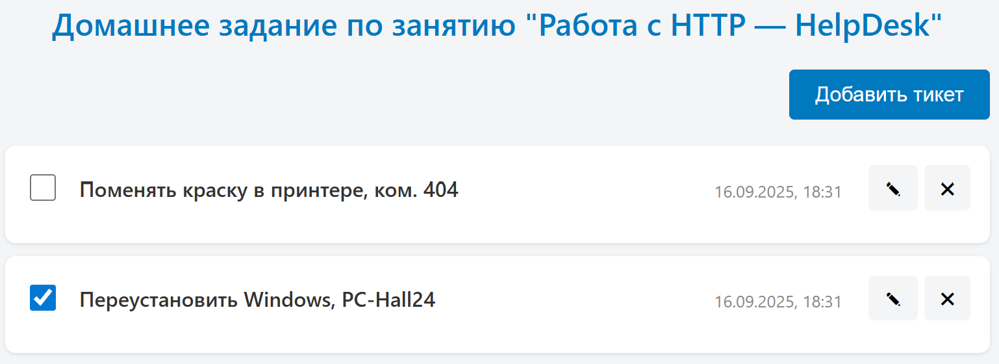
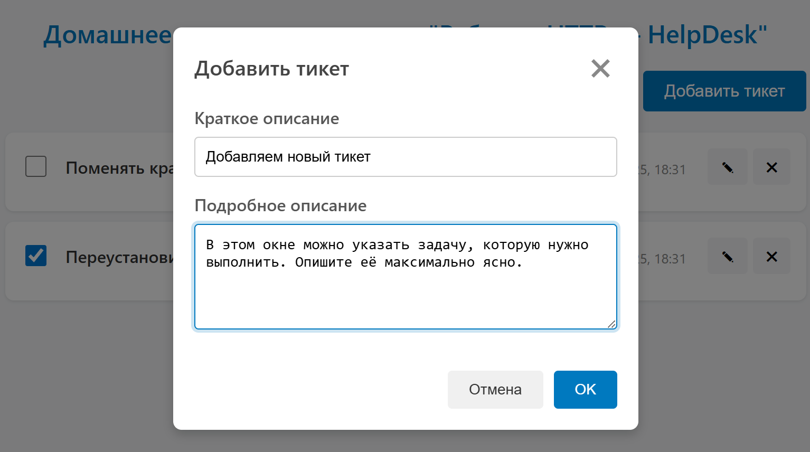
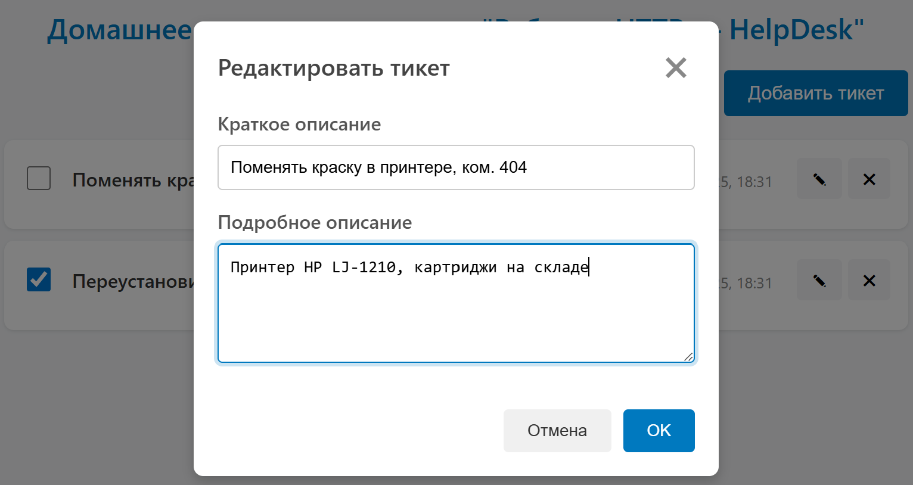
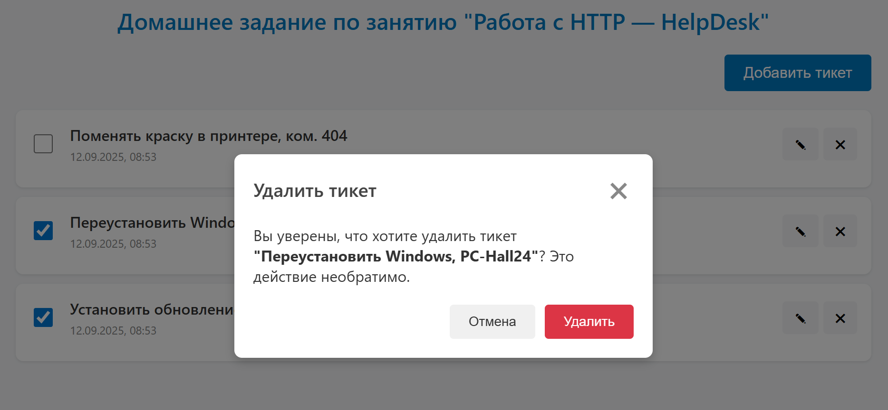
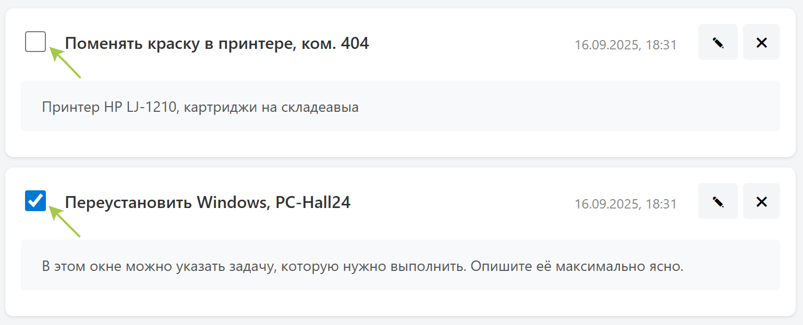
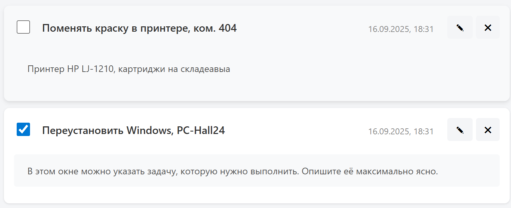

# Работа с HTTP: HelpDesk

---

### Статус проекта
[](https://ci.appveyor.com/project/dm-morozov/netology-58-working-with-http-helpdesk-hw)


[**Ссылка на проект на GitHub Pages**](https://dm-morozov.github.io/Netology_58_working_with_http_HelpDesk_hw/)

---

## 📋 Описание проекта

Это frontend-часть приложения "HelpDesk", разработанная в рамках домашнего задания по курсу "Работа с HTTP". Проект представляет собой сервис по управлению заявками (тикетами). Взаимодействует с готовым REST API, который размещен на Render.com по адресу `https://helpdesk-server-h222.onrender.com`, и выполняет все операции: получение, создание, обновление и удаление тикетов.

### ✨ Реализованный функционал

  * **Отображение всех тикетов:** При загрузке страницы приложение получает и отображает актуальный список тикетов с сервера.

  

  * **Создание нового тикета:** По нажатию на кнопку "Добавить тикет" открывается модальное окно с формой для создания новой заявки.


  

  * **Редактирование тикета:** Кнопка с иконкой "✎" открывает модальное окно, позволяющее редактировать название и описание существующего тикета.

  

  * **Удаление тикета:** При нажатии на кнопку "✖" появляется модальное окно для подтверждения удаления.

  

  * **Отметка о выполнении:** Статус тикета можно изменить с помощью чекбокса. Изменения автоматически отправляются на сервер.

  

  * **Просмотр полного описания:** Двойной клик на тикете (за исключением кнопок) открывает или скрывает подробное описание заявки, которое подгружается отдельным запросом к серверу. Если описание отсутствует, выводится соответствующее сообщение.

  

### 📂 Структура проекта

Проект имеет следующую структуру каталогов:

```
.
├── Backend/
│   ├── src/
│   │   └── server.ts
│   └── ...
├── src/
│   ├── css
│   │   └── style.css
│   ├── ts/
│   │   ├── HelpDesk.ts
│   │   ├── index.ts
│   │   ├── interface.ts
│   │   ├── createRequest.ts
│   │   └── ...
│   ├── img/
│   └── index.html
└── ...
```

### 🛠️ Технологии

  * **TypeScript:** Весь код написан с использованием TypeScript для повышения надежности и поддержки.
  * **Webpack:** Используется для сборки проекта.
  * **GitHub Actions:** Автоматическая сборка и деплой проекта на GitHub Pages.
  * **npm:** Менеджер пакетов для управления зависимостями.
  * **Fetch API:** Для работы с HTTP-запросами к серверу.

-----

## 📧 Контакты

Если возникнут вопросы, пишите:

*  [LinkedIn](https://www.linkedin.com/in/dm-morozov/)
*  [Telegram](https://t.me/dem2014)
*  [GitHub](https://github.com/dm-morozov/)

---